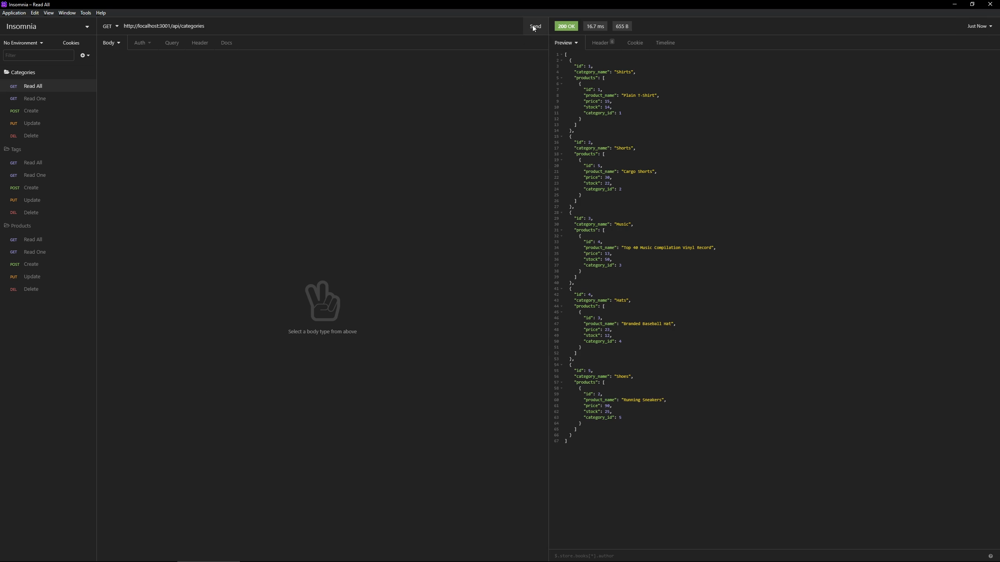

# E-commerce Back End

## Description

An e-commerce back end made with Object-Relational Mapping via Sequelize. Helps organize products into categories and via a tagging system. Products, categories, and tags all have CRUD endpoints within the api.

## Made with
- Node.js
- Express
- Sequelize
- MySQL2
- ES7 / ES 2016

## Installation

To install necessary dependencies, run the following command:

```
npm i
```

## Usage

Initialize the database using the schema.sql file found in the db directory

Run
```
npm run seed
npm start
```
You can use Insomnia for testing the api endpoints. A demonstration video is linked to the image below.

[](https://drive.google.com/file/d/16MBt4TzD4Gt2qMWEtbumMfSX4LT6rn0z/view?usp=sharing)
